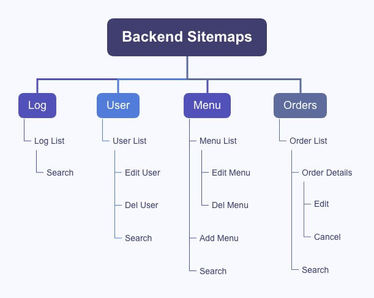

# Yanyan Cafe - Web Design Proposals

## Project Overview

The Yanyan Cafe Web Design project aims to create an advanced online platform to enhance user experience and streamline administrative operations, including user interactions, order processing, and administrative tasks.

### Objectives
1. **User Experience**: Provide a user-friendly interface for order placement, account management, and order tracking.
2. **Order Management**: Develop a robust backend for smooth transactions and accurate order tracking.
3. **Administrative Control**: Equip administrators with tools for efficient user, order, and menu management.

### Key Features
- **User Account Management**: Easy registration, login, profile updates, and account management with stored personal details.
- **Order Placement and Tracking**: Online order placement, order status viewing, and order history access, with detailed order tracking.
- **Menu Management**: Administrators and staff can update menu items, prices, and availability.
- **Logging and Monitoring**: Track system events with logs for security monitoring and troubleshooting.

## Project Scope

## Technologies

- Backend:
  - PHP, Composer
- Frontend:
  - HTML
  - JavaScript, jQuery
  - CSS, SCSS
  - daisUI, Tailwind CSS
- Database:
  - MySQL
- Hosting:
  - Amazon Web Services
  - Cloudflare
  - Apache Server

## Data Collection

- User Information:

  - Personal details including email, password, first name, last name, birthdate, and phone number will be collected
    to manage user accounts and provide personalized experiences.
  - Account details such as user roles, subscription status for newsletters, and a reference to
    the user’s avatar file will be stored.
  - Timestamps for account creation and updates, along with a flag indicating if the account is deleted, will be
    maintained to ensure accurate record-keeping and account management.

- Orders:

  - Order details will include user ID, order date, items ordered, and total amount. This information will help in
    tracking user purchases, managing orders, and providing a smooth transaction experience.

- Log Entries:
  - Logs of events,including descriptions and timestamps, will be maintained to monitor the system’s activities and
    ensure security and troubleshooting capabilities.

## User Types and Usage

1. **Admin:**

   - Full access to all system features.
   - Manage users, cats, menu, orders, and settings.
   - View logs.

2. **Staff:**

   - View and modify orders.
   - Update order prices.
   - Manage menu items.

3. **User:**
   - Place orders.
   - View order history.

## Data Models

### Conceptual

### Physical

## Sitemaps

### Frontend

### Backend

## Security

1. **XSS (Cross-Site Scripting):**

   - Implement strict input validation to ensure that all user inputs are sanitized.
   - Escape outputs to prevent malicious scripts from being executed in the browser.

2. **CSRF (Cross-Site Request Forgery):**

   - Not allowed. Ensure that state-changing operations are protected by other means such as requiring secure tokens or
     headers.

3. **SQL Injection:**

   - Use prepared statements and parameterized queries to prevent SQL injection attacks.
   - Validate and sanitize all inputs that are used in SQL queries.

4. **Infrastructure Security:**
   - Use AWS (Amazon Web Services) for hosting to leverage its robust security features, including data encryption,
     secure access controls, and network security.
   - Employ Cloudflare for web application firewall (WAF) and HTTPS to mitigate external threats and
     ensure secure communication.

## Design Comps

### Register Page

### Login Page

### Profile Page

### Admin Log Page

