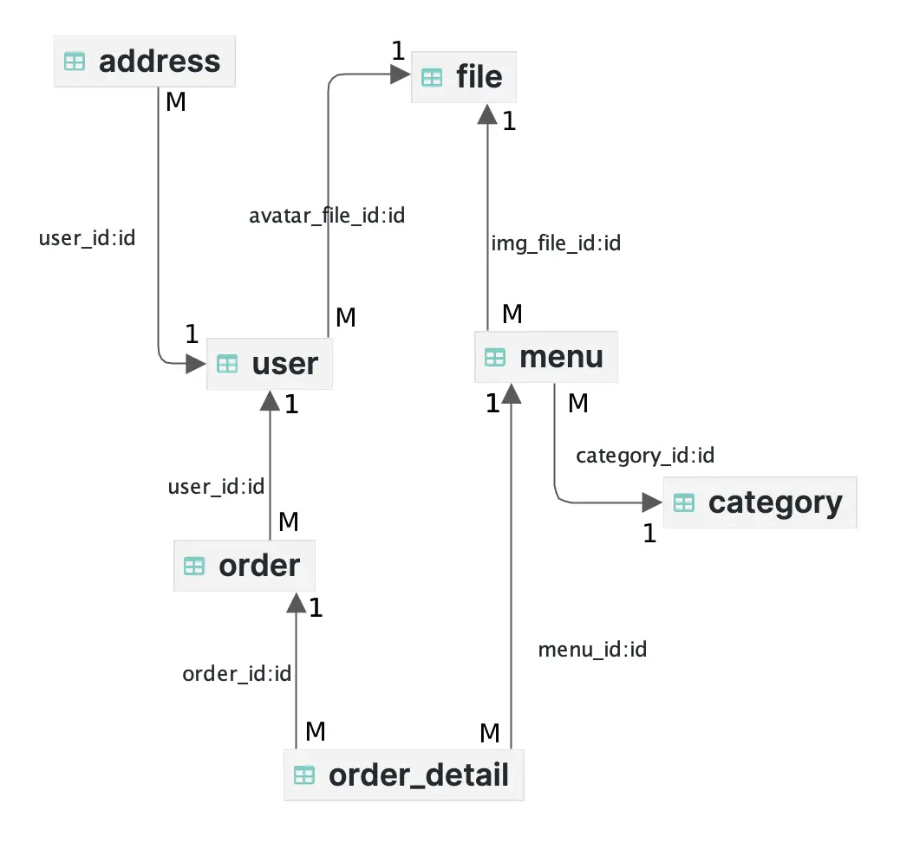

# Yanyan Cafe - Web Design Proposals

## Project Overview

## Project Scope

## Technologies

- Backend:
    - PHP, Composer
- Frontend:
    - HTML
    - JavaScript, jQuery
    - CSS, SCSS
    - daisUI, Tailwind CSS
- Database:
    - MySQL
- Hosting:
    - Amazon Web Services
    - Cloudflare
    - Apache Server

## Data Collection

- User Information:
    - Personal details including email, password, first name, last name, birthdate, and phone number will be collected
      to manage user accounts and provide personalized experiences.
    - Account details such as user roles, subscription status for newsletters, and a reference to
      the user’s avatar file will be stored.
    - Timestamps for account creation and updates, along with a flag indicating if the account is deleted, will be
      maintained to ensure accurate record-keeping and account management.

- Orders:
    - Order details will include user ID, order date, items ordered, and total amount. This information will help in
      tracking user purchases, managing orders, and providing a smooth transaction experience.

- Log Entries:
    - Logs of events,including descriptions and timestamps, will be maintained to monitor the system’s activities and
      ensure security and troubleshooting capabilities.

## User Types and Usage

1. **Admin:**
    - Full access to all system features.
    - Manage users, cats, menu, orders, and settings.
    - View logs.

2. **Staff:**
    - View and modify orders.
    - Update order prices.
    - Manage menu items.

3. **User:**
    - Place orders.
    - View order history.

## Data Models

### Conceptual

### Physical

## Sitemaps
### Frontend

## Security

## Design Comps

